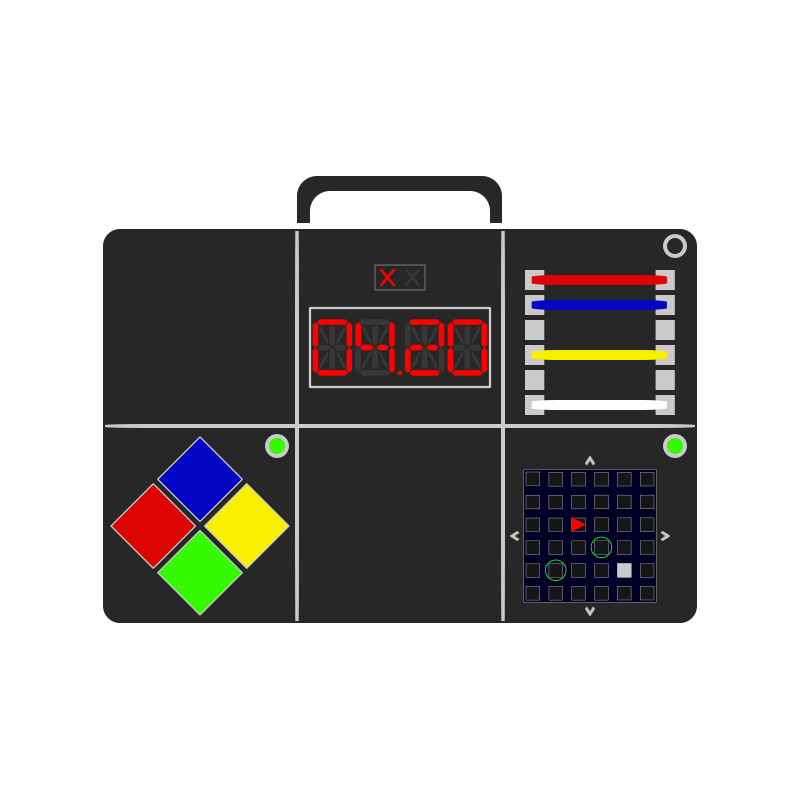

<h1> 

# KTANEirl

</h1>

[Keep Talking and nobody explodes](https://keeptalkinggame.com/) in real life!

 

KTANEirl is a modular in-hardware implementation of the famous puzzle video game KTANE.

## Modules

The modules information can be found in the [modules](modules/README.md) folder.

## Master

The master information can be found in the [master](master/README.md) folder.

## Contributors

* Module implementations: [@FinnArtmann](https://github.com/FinnArtmann), [@andreasfoOTH](https://github.com/andreasfoOTH), [@RebekkaSeidenschwand](https://github.com/RebekkaSeidenschwand)
* package controller: [@ZaykorDE](https://github.com/ZaykorDE)
* module logic and game logic: [@Emergency1999](https://github.com/Emergency1999)
* API: [@thomasniefanger](https://github.com/thomasniefanger)
* frontend: [@ptrLx](https://github.com/ptrLx)
* package simulator: [@Emergency1999](https://github.com/Emergency1999)
* schematics: [@FinnArtmann](https://github.com/FinnArtmann), [@andreasfoOTH](https://github.com/andreasfoOTH), [@ZaykorDE](https://github.com/ZaykorDE)
* 3D modeling: [@Emergency1999](https://github.com/Emergency1999)
